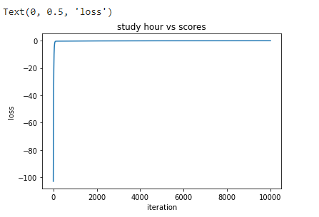
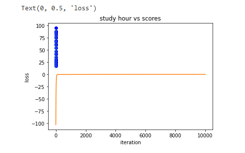

# Implementation-of-Linear-Regression-Using-Gradient-Descent

## AIM:
To write a program to implement the linear regression using gradient descent.

## Equipments Required:
1. Hardware – PCs
2. Anaconda – Python 3.7 Installation / Moodle-Code Runner

## Algorithm
1. For Gradient Design use the standard libraries in the python.
2. Use the .isnull()function to check the empty .
3. Use the default function.
4. Use the loop function for a linear equation.
5. Predict the value for the y.
6. Print the program.
7. plot the graph by using scatters keyword.
8. End the program

## Program:
```
/*
Program to implement the linear regression using gradient descent.
Developed by: Manoj Choudhary V
RegisterNumber:212221240025
import numpy as np
import pandas as pd
import matplotlib.pyplot as plt
navy=pd.read_csv("/content/student_scores - student_scores.csv")
navy.head()
navy.isnull().sum()
a=navy.Hours
a.head()
n=len(a)
m=0
c=0
L=0.001
loss=[]
for i in range(10000):
  ypred=m*x+c
  MSE=(1/n)*sum((ypred-y)*2)
  dm=(2/n)*sum(x*(ypred-y))
  dc=(2/n)*sum(ypred-y)
  c=c-L*dc
  m=m-L*dm
  loss.append(MSE)
print(m,c)
y_pred=m*x+c
plt.scatter(x,y,color="purple")
plt.plot(x,y_pred)
plt.xlabel("study hours")
plt.ylabel("scores")
plt.title("study hours vs scores")
plt.plot(loss)
plt.xlabel("iterations")
plt.ylabel("loss")
```

## Output:




## Result:
Thus the program to implement the linear regression using gradient descent is written and verified using python programming.
